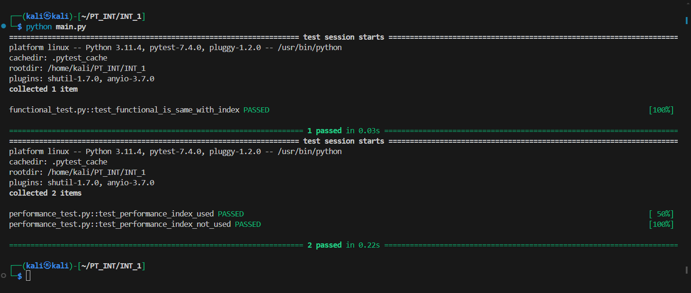
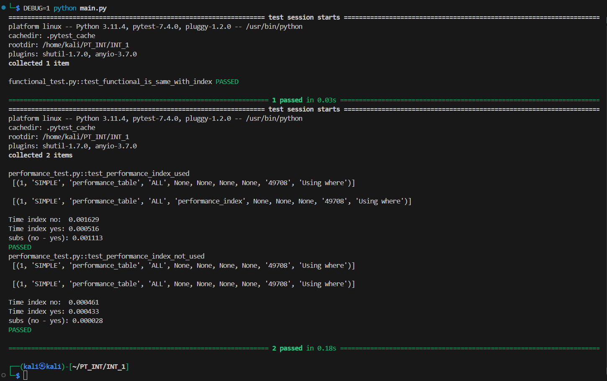

# INT-1 QA

## 1. Запуск
- Запустить mysql
- Создать базу данных `int_1_test_db`
- `pip install -r requirements.txt`
- `python main.py`
- Запуск в дебаге: `DEGUB=1 python main.py`

## 2. Тесты
- Результат тестов без дебага

- Результат тестов с дебагом

## 3. Описание
1. Функциональный тест без индекса и с индексом дает одинаковые результаты
2. Перформанс тест
    1. Чтобы на запросе типа str like индекс ускорял запрос, нужно использовать full-text индекс. В противном случае, запрос у меня не ускорялся.
    2. Индекс не используется даже при его наличии, если шаблон запроса имеет вид `'%str%'`. В таком случае, индекс не используется. Однако при этом, если индекс не full-text, то даже при таком запросе он используется иногда.
    3. У меня индекс однозначно не использовался только в случае, когда шаблон имел вид `'%str%'`, а сам индекс был full-text.